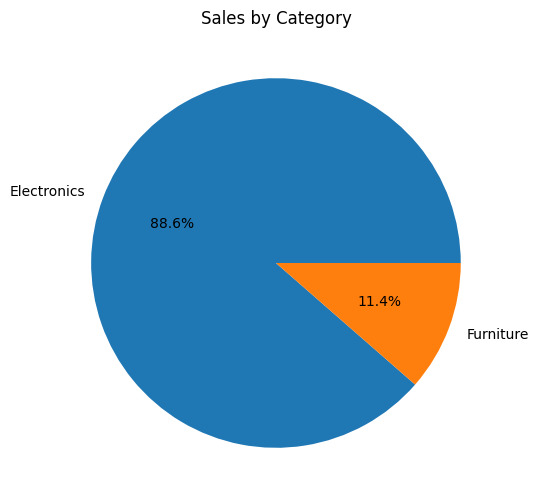

# 📊 Sales Data Analysis Project

## 📌 Overview

This project analyzes sales data to identify trends, top-performing regions, and product performance.

## 🛠 Tools Used

* Python (Pandas)
* Excel
* Matplotlib

## 📂 Dataset

Sample sales dataset containing order details, regions, products, and revenue.

## 🔍 Key Insights

* West region generated the highest sales
* Electronics category contributes most revenue
* Laptop is the top-performing product
* Sales show consistent growth over time

## 📊 Visualizations

* Bar Chart: Sales by Region
* Pie Chart: Sales by Category
* Line Chart: Monthly Sales Trend

## 📸 Dashboard Preview

## 🚀 How to Run

1. Download the dataset
2. Open the notebook in Jupyter or Google Colab
3. Run all cells
